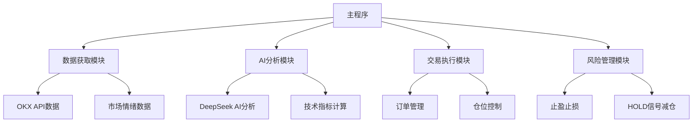

[README.md](https://github.com/user-attachments/files/23291560/README.md)
# BTC/USDT OKX 自动交易机器人

一个基于技术分析和AI辅助决策的比特币自动交易程序，专为OKX交易所设计。

⚠️⚠️⚠️⚠️ 警告 ⚠️⚠️⚠️⚠️ 这个版本因为为了测试交易情况给DeepSeek的提示词还有配置文件设的很激进 
⚠️⚠️⚠️⚠️ 警告 ⚠️⚠️⚠️⚠️ 用的话自己改稳一点哦 不会改可以直接找AI帮你优化下提示词和配置文件就好了

## 🌟 功能特点

- **🤖 自动化交易**：基于15分钟K线周期的全自动交易
- **🧠 AI辅助决策**：集成DeepSeek AI进行市场分析和交易信号生成
- **⚖️ 智能仓位管理**：根据市场状况和信号信心度动态调整仓位大小
- **🛡️ 风险管理**：内置动态减仓策略和灵活的止盈止损机制
- **📊 多因子分析**：结合技术指标、市场情绪和趋势分析进行决策
- **📈 实时监控**：完整的日志记录和交易过程追踪

## 🏗️ 系统架构



## 🚀 快速开始

### 环境要求

- Python 3.7+
- 依赖库：`ccxt`, `pandas`, `openai`, `python-dotenv`, `requests`

### 安装步骤

1. 克隆项目到本地：
   ```bash
   git clone <项目地址>
   cd dsox2
   ```

2. 安装依赖：
   ```bash
   pip install ccxt pandas openai python-dotenv requests
   ```

3. 配置环境变量（在 `.env` 文件中）：
   ```env
   DEEPSEEK_API_KEY=your_deepseek_api_key
   OKX_API_KEY=your_okx_api_key
   OKX_SECRET=your_okx_secret
   OKX_PASSWORD=your_okx_password
   SENTIMENT_API_KEY=your_sentiment_api_key
   ```

4. 根据需要调整 `config.json` 配置文件。

### 运行程序

```bash
python dsox.py
```

## ⚙️ 配置说明

详细配置说明请参考 [CONFIGURATION.md](CONFIGURATION.md) 文件。

主要配置项包括：
- **基础交易参数**：交易对、杠杆、时间周期等
- **仓位管理策略**：动态调整仓位大小
- **止盈止损设置**：根据信号信心度设置点位（默认关闭）
- **HOLD信号处理策略**：动态减仓控制风险

## 📈 交易策略

### 信号生成

程序使用以下多维度分析生成交易信号：

1. **技术分析**：
   - 移动平均线（3/5/8/20/50周期）
   - MACD指标
   - RSI指标
   - 布林带
   - 成交量分析

2. **市场情绪**：获取并分析市场情绪数据

3. **AI辅助决策**：使用DeepSeek AI综合分析各项指标生成交易信号

### 仓位管理

根据以下因素动态计算仓位大小：
- 信号信心度（高/中/低）
- 市场趋势强度
- RSI超买超卖状态
- 市场波动率
- 成交量变化
- 连续同向交易衰减

### 风险控制

1. **动态减仓**：当连续出现HOLD信号时，根据市场条件动态减仓
2. **止盈止损**：可根据信号信心度设置不同的止盈止损点位（默认关闭）
3. **资金管理**：确保单笔交易风险不超过账户资金的一定比例
4. **频率控制**：避免过度交易，设置最小交易间隔

## 📋 使用方法

### 启动程序

运行程序：
```bash
python dsox.py
```

程序启动后会执行以下操作：
1. 自动连接到OKX交易所
2. 验证账户设置和合约规格
3. 清理未完成订单确保干净启动
4. 每15分钟分析市场数据并生成交易信号
5. 根据信号执行交易操作

### 监控和日志

程序会生成详细的日志文件 `trading_bot.log`，包含：
- 📊 交易信号和决策过程
- 💼 仓位变化和订单执行情况
- 💰 账户余额和盈亏信息
- ⚠️ 错误和异常处理

日志格式示例：
```
2025-11-03 10:00:00 | INFO    | 📊 执行时间: 2025-11-03 10:00:00
2025-11-03 10:00:01 | INFO    | ⚙️ 已重新加载配置: 杠杆20x, 周期15m
2025-11-03 10:00:05 | INFO    | 💰 BTC当前价格: $72,568.90
```

## ⚠️ 重要注意事项

### 风险提示
⚠️ **加密货币交易存在高风险，请根据自身风险承受能力使用**

### 资金管理
- 建议使用闲置资金进行交易，不要投入全部资金
- 合理设置仓位大小和杠杆倍数
- 定期检查账户风险敞口

### 系统运行
- 确保网络连接稳定，避免因网络问题导致交易失败
- 注意交易所API调用频率限制
- 定期检查日志文件，监控系统运行状态

### 测试建议
- 强烈建议先在测试模式下运行一段时间
- 观察交易信号和执行逻辑是否符合预期
- 确认无误后再切换到实盘交易模式

## 🛠️ 故障排除

常见问题及解决方案：

| 问题 | 可能原因 | 解决方案 |
|------|---------|---------|
| API连接失败 | API密钥错误或网络问题 | 检查API密钥和网络连接 |
| 订单执行失败 | 账户余额不足或仓位设置错误 | 检查账户余额和仓位设置 |
| AI分析错误 | API密钥或网络连接问题 | 检查API密钥和网络连接 |
| 数据获取失败 | 交易所API状态异常 | 检查交易所API状态 |

## 📚 详细文档

- [配置说明](CONFIGURATION.md) - 详细的配置参数说明
- [更新日志](CHANGELOG.md) - 版本更新记录

## 📞 联系方式

如有问题或建议，请提交issue或联系开发者。
